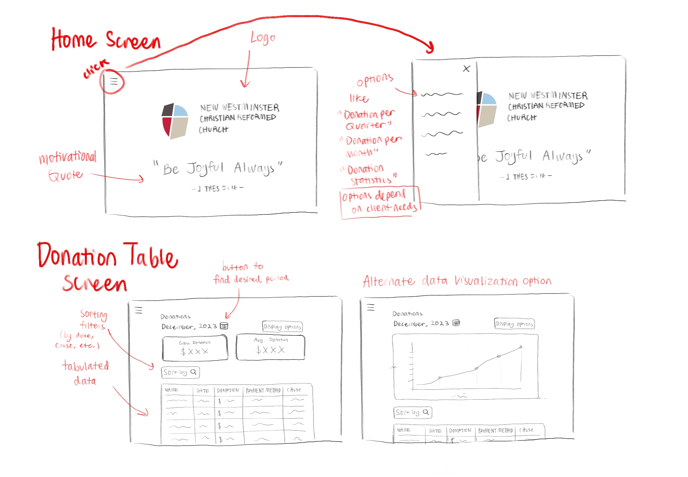

# **DonateDesk**

# Project Overview

## **Application Concept** 

DonateDesk is a browser-based application designed for New Westminster Christian Reformed Church (NWCRC) to streamline the process of collecting, managing and displaying donation information. Our aim for this application is to create a positive, user-friendly experience that enhances the church administrator’s ability to organize, track, and display details about donations. 

### **Group Members**  

**Gurchain**  
Skills: Git, C/C++, MongoDB, some Java

**Elysa**  
Skills: python excel (.xls) data processing, HTML, CSS, C/C++

**Lucia**  
Skills: Java C/C++, HTML, SQL, Unity

**Cas**  
Skills: Basic python and C++, UI design, illustration  

### **Follow-up Meetings**

Weekly meeting: every Friday 2:45 pm, Surrey Campus  
(4pm on Discord, in case of absence)  
Additional meetings scheduled as needed  

## **Project Proposal Write-Up**  
  

---
  

### **Application Name:** DonateDesk  

### **Target Audience:**  

DonateDesk’s target audience is New Westminster Christian Reformed Church administrative staff. The application aims to foster an accessible and user-friendly experience for staff of varying technological proficiency. With DonateDesk, the staff will be able to easily access, view and enter donation data.

### **Problem Understanding**  

The New Westminster Christian Reformed Church (NWCRC) currently collects donation related data, like the names of donors and payment methods.This data is obtained through a third party app and automated email notifications. The data is spread out over many Excel files and emails. The NWCRC would like donation data to be simplified and consolidated.

### **Solution and Impact**  

Our application aims to change the way the New Westminster Christian Reformed Church manages its data by introducing an automated system for handling Excel files and email data. This is expected to replace the manual processes currently in place, which are not only time-consuming but also have a high chance of human mistakes. By automating these tasks, the application can make data management more efficient and accurate. The application will enable office administrators and assistants to easily upload Excel files or select data from an existing database to be reformatted and downloaded as new Excel files. These features will ensure that donation-related data, such as donor names, payment methods, and designated causes, is more accurately and efficiently managed.

The impact of this application not only increases the operational efficiency but also improves the lives of the church's administrative staff by freeing up their time, and allowing them to dedicate more energy to their other services. By centralizing and simplifying the donation data handling process, the church can better track and analyze donation patterns, improving its ability to make informed decisions and having better ideas of how to plan the church's activities. For the church community, this means more resources can be directed towards meaningful programs and services, enriching the community's social life. 

### **Project Scope**  

DonateDesk allows for a clearer understanding of the NWCRC’s donations, while increasing convenience. DonateDesk will give NWCRC staff an overview of gathered data and serve appropriate metrics. We could show the distribution of donations for a given cause over time, or highlight important dates. The app will also provide a casual exploration of the data, using quizzes and games. Questions like, “Who was the largest donor in the month of april”, could be asked. These data analysis features will be paired with utilities, like Excel file conversion and email collection. This would help organize and deobfuscate the organization’s data. All of these features would be managed by permission control scheme to ensure the data is safely handled. These data analysis functions and productivity tools make up the ‘epics’ of our project, they will take significant time and coordination to produce.

The user roles for this application consist of an office administrator and office assistant accounts. Admins will be responsible for managing the permissions available to assistants. The admin will also manage connected email accounts and permitted senders for email related features. Both user types use the web app to access and understand donation data.

The ‘Convert Excel’ user scenario illustrates how our application will simplify Excel files for admins and assistants. Users will need to be logged in, have read/write permission and have premade Excel files ready. The user will send at least one Excel file to the system, with an option to store this data in the application’s database. The system will extract the data from these Excel files and output a single Excel file. The system must be able to parse and output Excel files without error. This requirement can be tested using mock files, the output file should match the mock data exactly. The ‘Convert Excel’ user scenario should be completed by iteration 2.  

The ‘Extract Email’ user story illustrates how our application will allow admins and assistants to easily download data sourced from email notifications. Users will need to be logged in with read permission. The system will need to update the data from emails beforehand. Upon request, the system will provide the user with previews of data collected from a connected email account. The user will then select the data they would like to download. This process requires email data to be obtained from admin approved senders. The system can be tested with malformed emails and messages from unapproved senders.

Future stories that may be developed include, login and user creation, permission control and data analysis. Also, scenarios for casual data exploration through quizzes and games can be created. Finally user stories involving motivational quotes may be present in the future.

### **Potential web API research**  

Outlook Web API  
The Outlook Web API provides programmatic access to Outlook mail, calendars, contacts, and tasks, allowing developers to integrate Microsoft's mail, calendar, contacts, and task services into their applications. It supports operations like reading, composing, and sending emails, managing calendar events, and accessing contacts and tasks.

Zen Quotes API  
The Zen Quotes API offers access to a wide collection of inspirational and motivational quotes from various authors, public figures, religious figures, etc. It can be used to fetch quotes for the daily motivational quote feature of the application.

Web Animations API  
The Web Animations API allows for more powerful and complex animations in web applications, providing a way to create, control, and animate elements directly in the browser without relying on CSS animations or JavaScript libraries. It provides a unified model for animations, enabling scriptable animations with more control and efficiency.

Google Calendar API  
Google Calendar API: Enables employees to track donations received from time periods and do analysis. 

Stripe API  
For if people could actually donate there.

Permission API  
For donors and admins to access different content. 

### **UI mockup draft**  

The following sketches visualizes the home screen and donation data visualization.  

*UI Mockup draft*  

The home page (i.e. the first page the user sees when loading the application) features a minimalistic design with the Church’s logo and a daily motivational Bible quote. A menu button is included, featuring options to take the user to other pages. The donation information page features tabulated donation data as well as other insightful data visualizations. In future sketch iterations, other kinds of data visualization options will be explored to suit the client’s needs. 
Future mockups will include pages for other potential features for DonateDesk including excel conversion, email extraction and report generation. 

### **Competitive Analysis**  

There are several applications and techniques that the NWCRC could use to emulate features of DonateDesk. Tableau is the most popular data analysis solution, it can provide sophisticated metrics. However, Tableau is a paid business focused application. A simpler, free, alternative would probably be more suitable for the church’s needs. The NWCRC could also approach its technical partners and ask them to reformat their messages. The church currently receives Excel data from The Bridge App, a communication and management app for people and organizations. The NWCRC could ask The Bridge App to simplify their outputs, but DonateDesk would solve both of these problems in a single app. Our application would also have unique features, such as email collection and casual data based games. The polish and support other applications can provide to the church are not enough. The NWCRC needs a custom solution. DonateDesk can compete with other solutions by providing unique features with a focus on integration and usability. 

## **GitHub Repository**
GitHub repository link: https://github.com/ElysaLin18/CMPT-276-Group-Project

